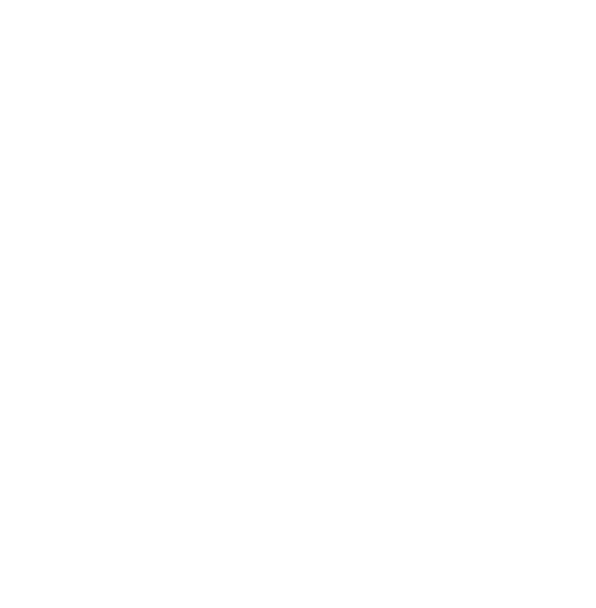

# MultimediaProject

<p align="center">
  
</p>

<p align="center">
  <a href="https://python.org/"></a>
  
  
  
</p>

<p align="center">
  <b>Powerful, modular toolkit for image steganography and watermarking.<br/>
  Featuring DCT, DFT, DWT, LSB, DSSS algorithms and a modern GUI.</b>
</p>

---

## 🚀 Demo

<p align="center">
  
  <br/>
  <i>Example: Interactive GUI for watermarking and steganography</i>
</p>

---

## ✨ Features

| Feature      | Support |
|--------------|:-------:|
| DCT          |   ✅    |
| DFT          |   ✅    |
| DWT          |   ✅    |
| LSB          |   ✅    |
| DSSS         |   ✅    |
| Text Watermarking | ✅ |
| Image Watermarking | ✅ |
| GUI          |   ✅    |

---

## 📦 Getting Started

> **Requirements:**<br/>
> - Python 3.13.3 or newer<br/>
> - Tkinter 8.6 or newer (mandatory, for GUI)<br/>
> - pip, Git

### Installation

1. **Clone the repository:**
   ```sh
   git clone https://github.com/yourusername/MultimediaProject.git
   cd MultimediaProject
   ```
2. **Run the boot script:**
   ```sh
   python boot_script.py
   ```
   The boot script will:
   - Check Python and Tkinter versions
   - Set up a virtual environment
   - Install all dependencies
   - Prepare the project for first use

   **After installation, the GUI will launch automatically.**

#### Boot Script Flags
- `--no-emoji` : Disables emoji in log and console output
- `--force-recreate` : Forces recreation of the virtual environment

Example:
```sh
python boot_script.py --no-emoji --force-recreate
```

---

## 🖥️ Usage

### 1. **Using the GUI (Recommended)**
- The GUI opens automatically after installation, or run:
  ```sh
  python app.py
  ```
- **Select the images** for cover and watermark/secret from the `images/` folder.
- Choose the algorithm, load images, and visualize results interactively.
- **Strongly recommended** for best experience and to avoid manual errors.

### 2. **Running Algorithms from Terminal (Advanced/Optional)**
- Example (DCT full image watermarking):
  ```sh
  python algorithms/DCT/Image/DCT-full.py images/lena.png images/mark.png
  ```
- Use images from the `images/` folder.
- Output images and metrics will be saved in the working directory.
- **Note:** Direct script execution is possible but the GUI is preferred.

---

## 🧪 Testing

- **Manual:** Run scripts in `algorithms/` with sample images from `images/`.
- **Automated:** If available, run test scripts or use `pytest`.
  ```sh
  pytest
  ```

---

## 📝 Notes
- `.gitignore` excludes macOS system files and unnecessary artifacts.
- For any issues, use `boot_script.py` for guided setup.

---

## 👤 Authors
- Matteo Gallina <matt.gallina@gmail.com>
- Graziana Calderaro <your.email@example.com>
- Emily Gigliuto <your.email@example.com>
