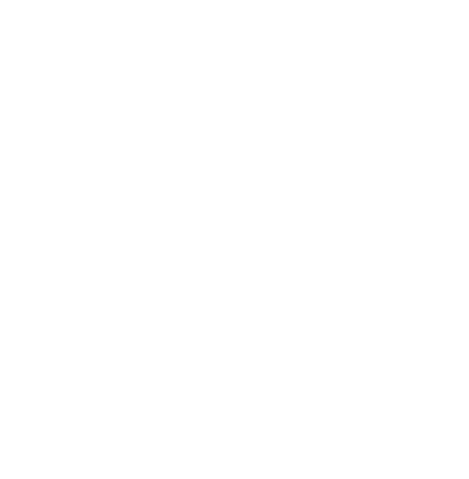

# 📦 MultimediaProject

<p align="center">
  
</p>

<p align="center">
  
  
  
</p>

> **Toolkit modulare per steganografia e watermarking**  
> Include GUI moderna, algoritmi avanzati (DCT, DFT, DWT, LSB, DSSS) e supporto multipiattaforma.

---

## 🎯 Perché usarlo?

Hai mai voluto nascondere un'informazione in un'immagine o proteggere i tuoi contenuti multimediali con un watermark invisibile?

**MultimediaProject** ti permette di farlo in modo semplice e interattivo grazie a:
- un’interfaccia grafica intuitiva
- algoritmi classici e moderni per la manipolazione delle immagini
- supporto completo per test, confronto e visualizzazione dei risultati

---

## 🖼️ Demo

<p align="center">
  
  <br/>
  <i>GUI per steganografia e watermarking</i>
</p>

---

## ✨ Funzionalità

| Funzionalità / Feature      | Stato / Support |
|----------------------------|:--------------:|
| Interfaccia GUI / GUI      |      ✅        |
| Steganografia (testo/img) / Text & Image Watermarking | ✅ |
| Watermarking               |      ✅        |
| DCT                        |      ✅        |
| DFT                        |      ✅        |
| DWT                        |      ✅        |
| LSB                        |      ✅        |
| DSSS                       |      ✅        |
| Esecuzione da terminale    |      ✅        |
| Testing automatico         |      ✅        |

---

## ⚙️ Requisiti

- **Python 3.13+**
- **Tkinter 8.6+**
- **pip**
- **Git**

> ✅ Compatibile con **Windows**, **Linux**, **macOS**

---

## 🚀 Installazione rapida

1. Clona il progetto:
   ```bash
   git clone https://github.com/DarkPhoenixz/MultimediaProject.git
   cd MultimediaProject
   ```

2. Esegui il boot script:
   ```bash
   python boot_script.py
   ```

> Il boot script verifica le versioni, crea un ambiente virtuale, installa le dipendenze e avvia la GUI.

### ⚡ Opzioni Boot Script
```bash
python boot_script.py --no-emoji --force-recreate
```

### 💡 Installazione manuale alternativa
```bash
python -m venv venv
# Windows
venv\Scripts\activate
# Linux/macOS
source venv/bin/activate

pip install -r requirements.txt
python app.py
```

---

## 🧑‍💻 Utilizzo

### 🔹 Modalità GUI (consigliata)
```bash
python app.py
```
- Seleziona immagini da `images/`
- Scegli l’algoritmo
- Visualizza e salva i risultati

### 🔹 Modalità terminale (avanzata)
```bash
python algorithms/DCT/Image/DCT_full.py images/lena.png images/mark.png
```

---

## 🧪 Testing

```bash
# Attiva l’ambiente virtuale
pytest -v
```
- Test basati su immagini reali
- Output: PSNR, SSIM, immagini risultato

---

## 📎 Note
- `.gitignore` esclude file di sistema e ambienti virtuali
- GUI consigliata per evitare errori manuali
- Ogni algoritmo ha un proprio modulo indipendente

---

## 👥 Autori

| Nome               | Email                         | Ruolo                        |
|--------------------|-------------------------------|------------------------------|
| Matteo Gallina     | matt.gallina01@gmail.com      | Backend, documentazione      |
| Graziana Calderaro | grazycalde@virgilio.it        | GUI, testing                  |
| Emily Gigliuto     | gigliutoemily@gmail.com       | UI design, user experience   |

---

## 📬 Contatti & Feedback

Hai domande o suggerimenti? Apri una issue o scrivici!
